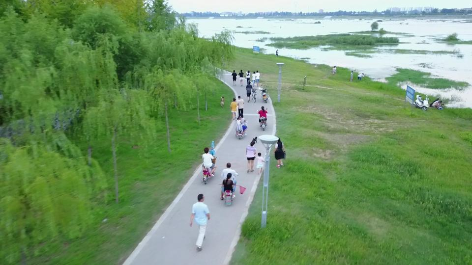

# Crowd detection from drones with fully-convolutional neural networks

In this repository, we provide our crowd detector for drone-captured images, described in the [paper](https://link.springer.com/chapter/10.1007/978-3-030-38919-2_25) we presented at SOFSEM2020. The method is based on a fully-convolutional network pre-trained on a subset of the challenging [VisDrone](https://github.com/VisDrone) dataset.

The proposed method is based on a two-loss model in which the main classification task, aimed at distinguishing between crowded and noncrowded scenes, is simultaneously assisted by a regression task, aimed at people counting. Based on the well-known [Grad-CAM](https://arxiv.org/abs/1610.02391) technique, the method can also provide class activation heatmaps, useful to semantically augment the flight maps (an example is shown below). Finally, it is worth noting that by lowering the confidence threshold, the network achieved very high recall (about 97%), without sacrificing too much precision (about 78%).

The method may be beneficial to crowd analysis-related tasks, e.g. drone safe landing and video surveillance.

The code is written in Python. As deep learning framework, we used TensorFlow and the Keras API.

 

## Update

We improved upon the original model by replacing the auxiliary loss based on crowd counting with a loss based on the agglomeration tendency of the crowd. This helped the model better learn the concept of "crowdedness". These results have been published in [IEEE Access](https://ieeexplore.ieee.org/document/9052702). Indeed, both models are maide available in the "models" folder.

### Acknowledgment

This work was supported by the Italian Ministry of Education, University and Research within the RPASInAir Project under Grant PON ARS01_00820. The Jetson TX2 used for this research was donated by the NVIDIA Corporation.
